# userInfoServices — a code-first walkthrough

Inspected on 23 September 2026. Project: `C:\Users\NagarajanSubramani\Services\userInfoServices`.

This guide describes the files currently in the project. It does not execute SQL, start the service, or change application code. All sample users, IDs and responses are illustrative.

## 1. First understand the three different times

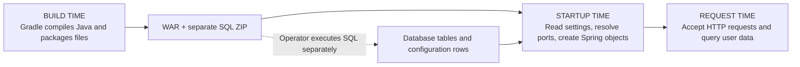

- Building creates deployable files. It does not create Oracle tables.
- Startup reads the port configuration and prepares the application. It does not run the packaged SQL scripts.
- Requests create/read users and check credentials. They do not reread the port table on every call.
- A database-port change requires a service restart. It is not a live configuration refresh.

This is one Spring Boot application, one executable WAR and one main entry class. The other Java files are cooperating classes, not separately running services. It is a **Eureka client**, not the Eureka discovery server itself.

## 2. Folder map

```text
userInfoServices/
├── build.gradle                         Build instructions and dependencies
├── settings.gradle                      Gradle project identity
├── gradle.properties                    Gradle JVM/worker settings
├── gradlew                              Wrapper launcher: Git Bash/Linux
├── gradlew.bat                          Wrapper launcher: Windows
├── gradle/wrapper/
│   ├── gradle-wrapper.jar               Wrapper bootstrap code
│   └── gradle-wrapper.properties        Gradle distribution/version/checksum
├── .gitignore                           Files Git should ignore
├── README.md                            Setup, configuration and API usage
├── VALIDATION.md                        Recorded verification and limitations
├── db/
│   ├── USER_INFO_SCHEMA/
│   │   └── 002_create_user_details.sql   Creates the user-data table
│   └── EUREKA_DB/
│       └── 003_seed_port.sql            MERGE userInfoServices port = 8770
├── src/
│   ├── main/
│   │   ├── java/com/oxygenraj/userinfo/
│   │   │   ├── UserInfoServicesApplication.java
│   │   │   ├── api/                     HTTP input, output, routes and errors
│   │   │   ├── config/                  Startup, database settings and security
│   │   │   ├── domain/                  Internal user representation
│   │   │   ├── repository/              SQL and result mapping
│   │   │   └── service/                 Business rules and transactions
│   │   └── resources/
│   │       ├── application.yml          Runtime settings and defaults
│   │       └── META-INF/spring.factories Startup processor registration
│   └── test/
│       ├── java/com/oxygenraj/userinfo/
│       │   ├── api/                     Real HTTP/security tests
│       │   └── config/                  Startup/port/credential tests
│       └── resources/test-schema.sql    Disposable H2 test schema
├── build/                               Generated output, not source
│   ├── classes/                         Compiled .class files
│   ├── resources/                       Copied resources
│   ├── generated/sources/              Annotation-processor/header locations
│   ├── libs/                            WAR and SQL ZIP
│   ├── reports/tests/test/              Human-readable test report
│   ├── test-results/test/               Machine-readable test results
│   └── tmp/                             Build intermediates
├── .gradle/                             Local Gradle cache/state
├── .idea/                               Local IDE metadata
└── .oca/                                Local tool metadata/guidance
```

The last generated/tool folders are not application packages. Do not edit `build/classes` or `build/resources` to make permanent source changes; rebuilds replace their contents. The project's Gradle source sets use `src/main` and `src/test`, not the IDE metadata. The inspected `build/generated` folders contain no generated files; no generated business code is being implied. There is no `.git` directory inside this service root; Git uses the parent repository.

`com/oxygenraj/userinfo` mirrors the Java package name `com.oxygenraj.userinfo`. It is a namespace, not a network address or URL. Spring discovers application components beneath the main application's package. Likewise, the folder named `api` does **not** add `/api` to the HTTP URL.

## 3. The overall runtime architecture

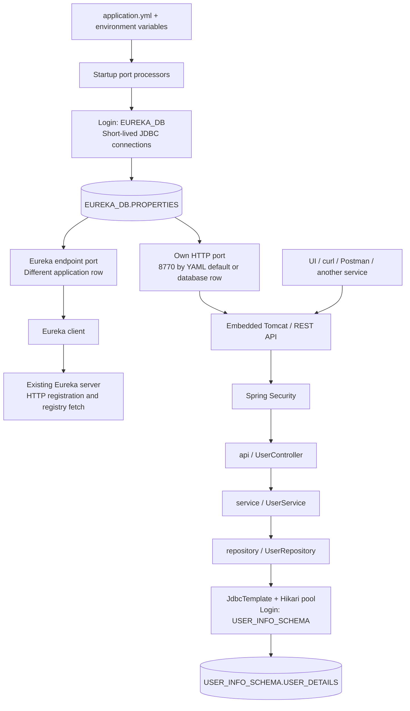

There are two database **connection configurations**, not necessarily two database servers. Both default to the same Oracle `FREEPDB1` reached through `127.0.0.1:11521`.

| Purpose | Login | Settings | Connection lifetime |
| --- | --- | --- | --- |
| User registration, lookup and password verification | `USER_INFO_SCHEMA` | `spring.datasource`; `USER_INFO_DB_URL`, `USER_INFO_DB_PASSWORD` | Hikari pool, reused while the application runs |
| Both startup port lookups | `EUREKA_DB` | `user-info.properties-datasource`; `EUREKA_DB_URL`, `EUREKA_DB_PASSWORD` | Open, query, close during startup |

There is no second pooled Spring `DataSource` bean for the port lookups. They run before the application context is ready, using JDBC directly.

Keep three identities separate:

1. `USER_INFO_SCHEMA` is the database account used by application code.
2. `EUREKA_DB` is the database account used to read shared settings.
3. A registered user such as `asha.dev` is an application user stored in `USER_DETAILS`. This is the identity used in HTTP Basic and `/authuserdetails`.

A database-account password is not the password of every application user.

## 4. Startup flow, from java -jar to a usable service

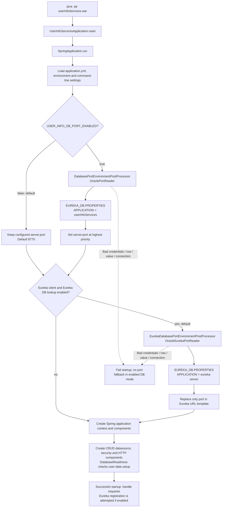

This is a dependency-level diagram, not an exact ordering of every internal Spring bean and Tomcat lifecycle callback. A successful Oracle port lookup does not prove the Eureka HTTP server is reachable or registration has succeeded.

### The entry class

[UserInfoServicesApplication.java](C:/Users/NagarajanSubramani/Services/userInfoServices/src/main/java/com/oxygenraj/userinfo/UserInfoServicesApplication.java)

- `main()` starts the application when using `java -jar`.
- `@SpringBootApplication` enables Spring Boot configuration and component discovery.
- `@EnableConfigurationProperties(ServerProperties.class)` makes server settings available as configuration properties.
- Extending `SpringBootServletInitializer` and overriding `configure()` also supports deploying the WAR into an external servlet container.
- In external Tomcat, its connector configuration owns the actual listening port. `server.port` does not reconfigure an external Tomcat connector.

### Why the processors run before Tomcat chooses its port

[spring.factories](C:/Users/NagarajanSubramani/Services/userInfoServices/src/main/resources/META-INF/spring.factories) registers the two `EnvironmentPostProcessor` implementations. These are startup hooks, not controllers.

- Own-port processor order: `ConfigDataEnvironmentPostProcessor.ORDER + 1`.
- Eureka-endpoint processor order: `ConfigDataEnvironmentPostProcessor.ORDER + 2`.

That means YAML is loaded first; the processors can then read settings and add higher-priority values before the application uses them. An ordinary controller method would be too late to choose the listening port.

### The two rows must not be confused

| Table | APPLICATION | PROFILE | LABEL | KEY | Meaning |
| --- | --- | --- | --- | --- | --- |
| `EUREKA_DB.PROPERTIES` | `userInfoServices` | `jdbc` | `jdbc` | `server.port` | This application's HTTP port; seed SQL sets 8770 |
| `EUREKA_DB.PROPERTIES` | `eureka-server` | `jdbc` | `jdbc` | `server.port` | Existing Eureka server's HTTP port |

`jdbc` here is a literal row selector. It does not by itself activate a Spring profile. Both queries bind all four selectors, so the two applications' rows stay separate.

The table stores configuration. This application does not write its Eureka registration into that table; registration is a separate HTTP interaction with Eureka.

## 5. Every config class

| File | What it does | What it does not do |
| --- | --- | --- |
| [PropertiesDatabaseSettings.java](C:/Users/NagarajanSubramani/Services/userInfoServices/src/main/java/com/oxygenraj/userinfo/config/PropertiesDatabaseSettings.java) | Binds the separate properties URL/password; requires username `EUREKA_DB`; rejects blank password and invalid JDBC URL; redacts its string representation | Does not fall back to USER_INFO credentials or open a Hikari pool |
| [DatabasePortEnvironmentPostProcessor.java](C:/Users/NagarajanSubramani/Services/userInfoServices/src/main/java/com/oxygenraj/userinfo/config/DatabasePortEnvironmentPostProcessor.java) | If enabled, reads the application's own DB port and inserts a highest-priority `server.port` property | Does not run on each HTTP request |
| [OraclePortReader.java](C:/Users/NagarajanSubramani/Services/userInfoServices/src/main/java/com/oxygenraj/userinfo/config/OraclePortReader.java) | Queries the `userInfoServices` row as EUREKA_DB | Does not read the Eureka server's row or update the table |
| [EurekaDatabasePortEnvironmentPostProcessor.java](C:/Users/NagarajanSubramani/Services/userInfoServices/src/main/java/com/oxygenraj/userinfo/config/EurekaDatabasePortEnvironmentPostProcessor.java) | Uses the other reader, preserves Eureka URL scheme/host/path and replaces the port | Does not change the user's own service port or implement discovery-server behavior |
| [OracleEurekaPortReader.java](C:/Users/NagarajanSubramani/Services/userInfoServices/src/main/java/com/oxygenraj/userinfo/config/OracleEurekaPortReader.java) | Queries the `eureka-server` row as EUREKA_DB | Does not register the application with Eureka itself |
| [DatabaseReadiness.java](C:/Users/NagarajanSubramani/Services/userInfoServices/src/main/java/com/oxygenraj/userinfo/config/DatabaseReadiness.java) | Checks USER_INFO_SCHEMA session/current schema/FREEPDB1 and queries expected USER_DETAILS columns with `WHERE 1 = 0` | Does not create tables, inspect all constraints or read all users |
| [SecurityConfiguration.java](C:/Users/NagarajanSubramani/Services/userInfoServices/src/main/java/com/oxygenraj/userinfo/config/SecurityConfiguration.java) | Creates the encoder, authentication manager, user loader and HTTP security rules | Does not create a JWT/login session or provision database accounts |

Both Oracle port readers require exactly one matching row and an integer port from 1 to 65535. They check session/current schema `EUREKA_DB` and container `FREEPDB1`. They use bound query parameters, a 5-second connect setting, 10-second socket-read setting and 5-second statement timeout, then close JDBC resources. These are separate timeouts, not a promise of one exact total startup deadline.

Raw JDBC errors can include secrets. The readers deliberately retain a safe error message and numeric Oracle code without attaching the original JDBC exception. If port lookup fails before startup completes, this is a startup exception, not an `ApiExceptionHandler` JSON response.

Removing identity-check blocks from the packaged SQL did **not** remove Java runtime identity checks.

## 6. application.yml explained

[Open application.yml](C:/Users/NagarajanSubramani/Services/userInfoServices/src/main/resources/application.yml)

| Section | Meaning in this project |
| --- | --- |
| `spring.application.name` | Identifies the app as `userInfoServices` |
| `spring.datasource` | Oracle user-data connection, driver and pool settings |
| `spring.datasource.hikari` | Maximum pool size 5, minimum idle 1, pool connection wait 10 seconds, Oracle connect/read timeout settings |
| `spring.jdbc.template.query-timeout` | Default statement timeout of 5 seconds for JdbcTemplate |
| `spring.sql.init.mode: never` | Do not automatically execute schema/data scripts at startup |
| `user-info.properties-datasource` | Independent EUREKA_DB connection information |
| `user-info.database-port.enabled` | Whether own server port comes from the shared table |
| `user-info.eureka.database-port.enabled` | Whether Eureka endpoint port comes from the shared table |
| `server.address` | Default loopback binding; remote machines cannot reach this listener without explicit deployment configuration |
| `server.port` | Default 8770 when own DB lookup is disabled |
| `server.servlet.context-path` | Prefix `/userInfoServices` for application HTTP routes |
| `server.shutdown` | Graceful shutdown setting |
| `eureka.client` | Enable discovery, register instance, fetch registry and set endpoint template |
| `eureka.instance` | Advertised host, instance ID and relative status/health paths |
| `management` | Expose health/info; do not disclose detailed health information |
| `logging.level.root` | INFO-level root logging |

`Hikari maximum-pool-size: 5` means at most five pooled DB connections, not five users and not five HTTP request threads.

### Environment variables and their scope

| Variable | Default / role |
| --- | --- |
| `USER_INFO_DB_URL` | User-data JDBC URL; default `jdbc:oracle:thin:@//127.0.0.1:11521/FREEPDB1` |
| `USER_INFO_DB_PASSWORD` | Password of USER_INFO_SCHEMA; supply externally |
| `EUREKA_DB_URL` | Independent properties JDBC URL, same local default |
| `EUREKA_DB_PASSWORD` | Password of EUREKA_DB; required when either DB port lookup runs |
| `USER_INFO_DB_PORT_ENABLED` | `false`; set true for own-port table lookup |
| `USER_INFO_PORT` | `8770`; ordinary YAML-mode port |
| `USER_INFO_EUREKA_DB_PORT_ENABLED` | `true`; resolve Eureka's port from DB |
| `EUREKA_CLIENT_ENABLED` | `true`; false skips Eureka registration and its port lookup, but not an independently enabled own-port lookup |
| `EUREKA_URL` | `http://localhost/eureka-server/eureka/`; database mode supplies its port |
| `USER_INFO_BIND_ADDRESS` | `127.0.0.1` |
| `USER_INFO_HOSTNAME` | `localhost`, advertised to Eureka |

The exact flag `EUREKA_DB_PORT_ENABLED` is not used by this application. Do not confuse it with `USER_INFO_DB_PORT_ENABLED`.

The existing source has a local USER_INFO password fallback; it is intentionally not reproduced here. Prefer external secrets, especially for deployment. The EUREKA password has no usable default.

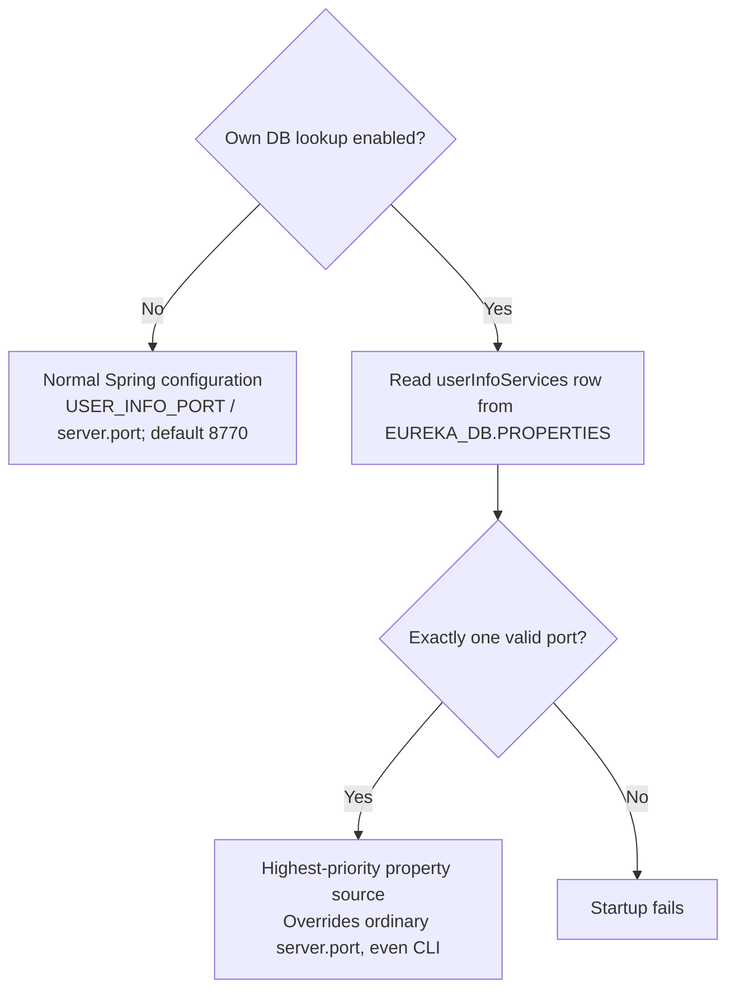

Example shell command, assuming both passwords are already exported and the tunnel is available:

```bash
USER_INFO_DB_PORT_ENABLED=true java -jar ./userInfoServices.war
```

The inline variable applies to that process. With this flag enabled, the value in the matching database row wins; it is not necessarily 8770 unless that row contains 8770.

`EUREKA_URL` uses the application host's network perspective. If Eureka is on another machine, replace localhost with a reachable host. Turning off Eureka DB lookup requires supplying a complete URL containing the real port. No code here establishes the SSH tunnel automatically.

## 7. The api folder: the external contract

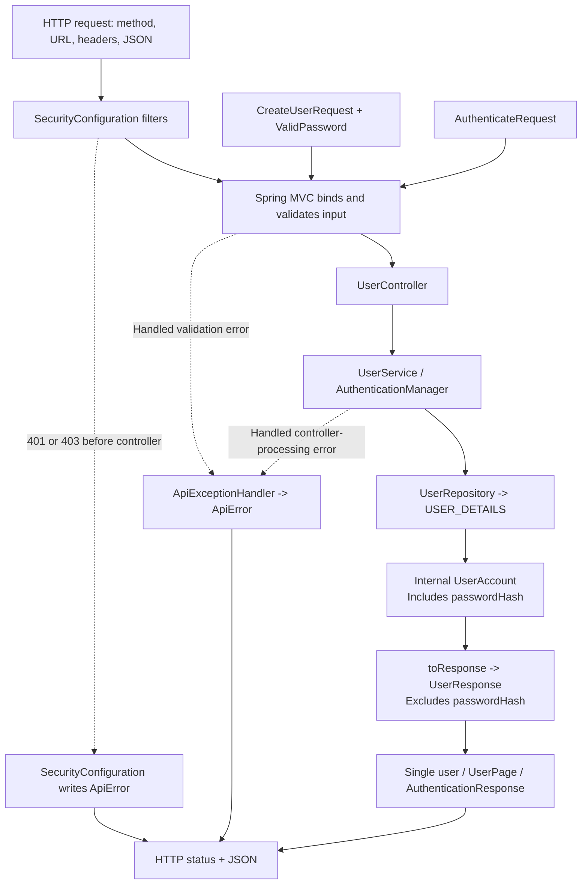

Three separate questions are answered:

- **Validation:** Is this input structurally acceptable?
- **Authentication:** Whose credentials are these?
- **Authorization:** Is that identity allowed to access this route or record?

### 7.1 UserController.java — choose the operation

[Source](C:/Users/NagarajanSubramani/Services/userInfoServices/src/main/java/com/oxygenraj/userinfo/api/UserController.java)

`@RestController` declares HTTP handlers whose return values become response bodies. The constructor receives `UserService` and `AuthenticationManager` from Spring; it does not construct them with `new` on every request.

All endpoint paths below are appended to the context path `/userInfoServices`.

| Method and relative path | Method in Java | Success | Access |
| --- | --- | --- | --- |
| `POST /userdetails` | `create()` | 201 + safe user + Location header | Public registration |
| `GET /userdetails?page=0&size=20` | `list()` | 200 + UserPage | ADMIN |
| `GET /userdetails/{id}` | `get()` | 200 + safe user | Authenticated owner or ADMIN |
| `POST /authuserdetails` | `authenticate()` | 200 + authenticated:true + safe user | Public credential verification |

The two POSTs consume `application/json`. `@RequestBody` deserializes JSON into a request record. `@Valid` checks that record's constraints before normal controller work.

`create()` delegates to the service, appends the returned ID to the request URL and uses `ResponseEntity.created(location)` to return HTTP 201. `Location` tells the caller where the created user resource is located.

`list()` accepts page 0–1,000,000 and size 1–100; defaults are 0 and 20. `get()` accepts a positive `long` ID. The `Authentication` parameter is the current request's security identity, not an extra JSON field.

`authenticate()` sends an unauthenticated Spring credentials object to `AuthenticationManager`. This `UsernamePasswordAuthenticationToken` is an internal Java object, **not a JWT issued to the caller**. Success returns the nested `AuthenticationResponse(boolean authenticated, UserResponse user)`. Failure produces an error, not a 200 response with `authenticated:false`.

### 7.2 CreateUserRequest.java — accepted registration input

[Source](C:/Users/NagarajanSubramani/Services/userInfoServices/src/main/java/com/oxygenraj/userinfo/api/CreateUserRequest.java)

A Java `record` is a compact data carrier with accessors such as `request.username()`. This one describes client input; it is not a database entity.

| Field | Validation | Notes |
| --- | --- | --- |
| username | Nonblank; 3–64 ASCII characters | First must be a letter/digit; later characters may also be dot, underscore or hyphen |
| password | Custom `@ValidPassword` | See next section |
| email | Nonblank, email format, max 254 characters | Format validation does not verify ownership of the mailbox |
| phoneNumber | Nonblank; 7–20 ASCII digits with optional leading `+` | Spaces, hyphens, parentheses and extensions do not match |

No ID, role, enabled flag, password hash or timestamp is accepted as a declared registration field. The repository chooses role USER and enabled 1.

Uppercase usernames pass validation and are later lowercased. Leading/trailing username spaces fail the regex before service normalization; do not assume normalization makes every invalid input acceptable.

The overridden `toString()` returns a redacted string. This reduces accidental exposure from object logging, but is not permission to log complete raw HTTP bodies.

### 7.3 ValidPassword.java — a custom validation rule

[Source](C:/Users/NagarajanSubramani/Services/userInfoServices/src/main/java/com/oxygenraj/userinfo/api/ValidPassword.java)

This file contains an annotation and its nested `ConstraintValidator` implementation. `@Constraint(validatedBy=...)` connects the annotation to the validator; runtime retention lets validation inspect it while the application runs.

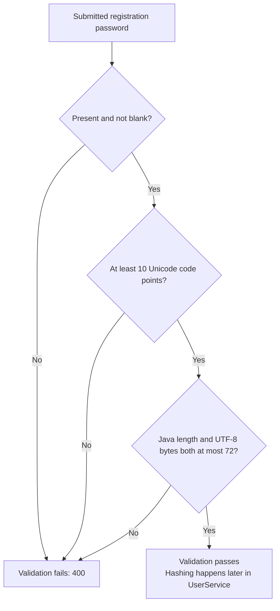

Nine ASCII characters fail; ten nonblank ASCII characters pass. Seventy-three ASCII characters fail. Ten ordinary four-byte emoji are 40 UTF-8 bytes and can pass; nineteen are 76 bytes and fail. A code point is not always the same as one visual character.

This validator does not require a digit/uppercase/symbol mixture, hash the password, trim it or query Oracle. It checks input only. The byte maximum is important for the BCrypt password encoder used by this service.

### 7.4 AuthenticateRequest.java — accepted credential-check input

[Source](C:/Users/NagarajanSubramani/Services/userInfoServices/src/main/java/com/oxygenraj/userinfo/api/AuthenticateRequest.java)

It contains only username and password. Both must be nonblank; username has a maximum length of 64 and password a maximum Java string length of 72. It also redacts `toString()`.

Login does not rerun the full registration username regex or the ten-code-point creation minimum. However, `SecurityConfiguration` still rejects password matching above 72 UTF-8 bytes. Depending on which check fails, malformed input produces 400 or incorrect/unacceptable credentials produce 401.

### 7.5 UserResponse.java — safe output

[Source](C:/Users/NagarajanSubramani/Services/userInfoServices/src/main/java/com/oxygenraj/userinfo/api/UserResponse.java)

Output fields: `id`, `username`, `email`, `phoneNumber`, `role`, `enabled`, `createdAt`, `modifiedAt`. The timestamps use `OffsetDateTime`.

There is no password or passwordHash field. The explicit conversion from internal `UserAccount` to public `UserResponse` prevents the normal controller return path from sending the stored hash.

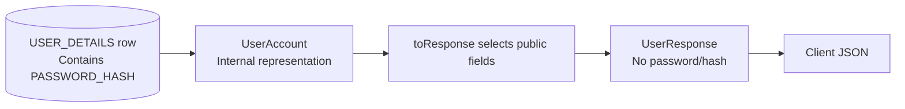

### 7.6 UserPage.java — a page, not every user at once

[Source](C:/Users/NagarajanSubramani/Services/userInfoServices/src/main/java/com/oxygenraj/userinfo/api/UserPage.java)

Fields: `content` (list of safe responses), `page` (zero-based index), `size` (requested capacity), `totalElements` (total user count).

Scratchpad: if 23 users exist and an admin requests page 1 with size 20, the offset is `1 × 20 = 20`. The response can contain 3 users, while size remains 20 and totalElements remains 23.

There is no `totalPages`, `hasNext` or configurable sort field in this record. An otherwise valid page beyond the available rows returns empty content. Content and count come from two SQL statements; do not assume they form one immutable snapshot while other requests change data.

### 7.7 ApiExceptionHandler.java — controlled error responses

[Source](C:/Users/NagarajanSubramani/Services/userInfoServices/src/main/java/com/oxygenraj/userinfo/api/ApiExceptionHandler.java)

`@RestControllerAdvice` handles specified exceptions during controller processing. Its nested `ApiError` contains `code`, `message`, `errors` (field/message map), and `timestamp`.

| Situation handled here | HTTP status | Code |
| --- | --- | --- |
| Invalid request-body fields | 400 | VALIDATION_FAILED |
| Invalid JSON/path/query or method parameter | 400 | INVALID_REQUEST |
| Duplicate username/email | 409 | USER_EXISTS |
| Missing or deliberately concealed user | 404 | NOT_FOUND |
| Credential verification failure | 401 | INVALID_CREDENTIALS |
| Propagated database data-access exception | 503 | DATABASE_UNAVAILABLE |

Validation errors include field names and messages, never rejected values such as submitted passwords. Only one recorded message per field is kept. Other handlers use an empty errors map.

This is not a catch-all for every possible failure. Security filters write their own 401 `UNAUTHORIZED` and 403 `FORBIDDEN` envelopes; startup failures happen before the REST application is ready. A 503 data-access mapping also does not necessarily mean a disconnected network: other SQL errors can be translated into `DataAccessException`.

## 8. Request-by-request flowcharts

### A. Create a user

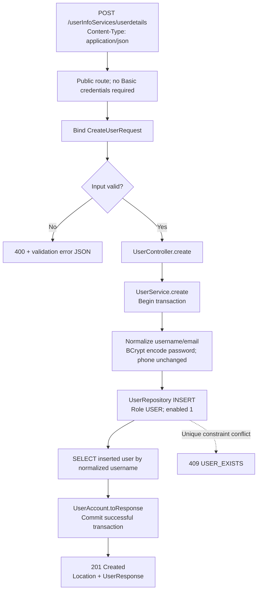

Uniqueness is enforced by Oracle constraints, not by a pre-insert `does this user exist?` query. The transaction covers insert and readback. The database generates ID and timestamp defaults.

### B. Verify a username and password

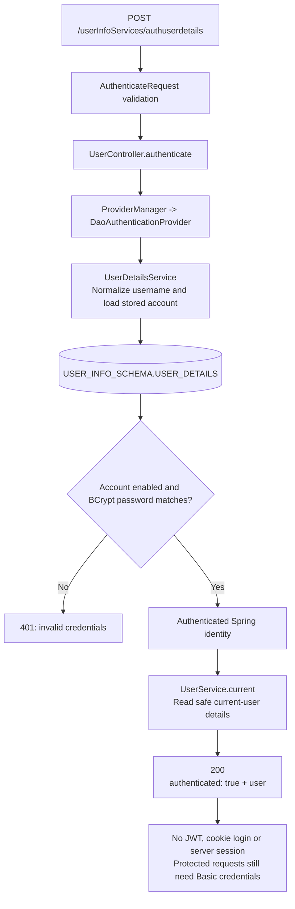

The authentication provider reads the user to verify credentials; `service.current()` reads it again to produce the response. These are distinct operations. Errors inside authentication/filter machinery are not necessarily mapped identically to direct repository errors in a controller call.

### C. Fetch one user's details

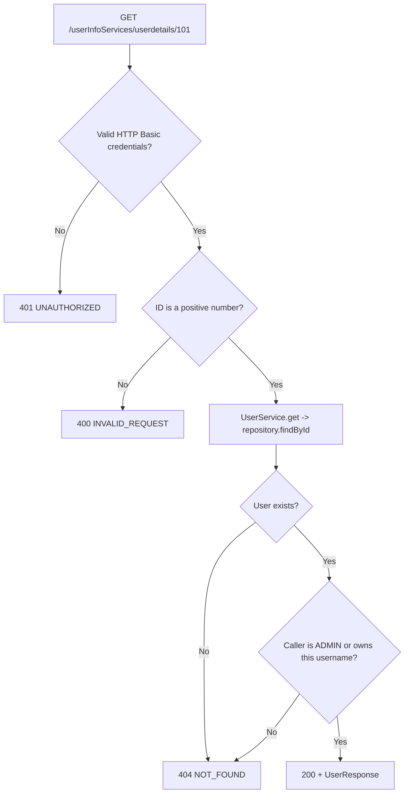

Returning 404 for another user's existing ID is deliberate: it avoids revealing whether that record exists.

### D. List users

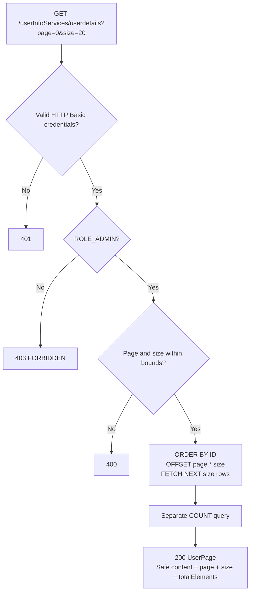

The ADMIN rule is in `SecurityConfiguration`, not inside `UserService.list()` itself. This matters if a future non-HTTP caller invokes that service method directly.

## 9. Service, repository and domain folders

### service/UserService.java

[Source](C:/Users/NagarajanSubramani/Services/userInfoServices/src/main/java/com/oxygenraj/userinfo/service/UserService.java)

This is the business layer. `@Service` lets Spring discover and inject it.

- `create()` normalizes username/email using `strip().toLowerCase(Locale.ROOT)`, hashes the unchanged password and delegates insertion. `@Transactional` groups insertion/readback.
- `list()` builds the page response from row results and total count. It is marked read-only transactional.
- `get()` loads the user and permits ADMIN or the matching normalized authenticated username. It is marked read-only transactional.
- `current()` returns the safe record for an authenticated username; it has no explicit transaction annotation here.
- `UserNotFoundException` signals both absence and deliberate concealment; the API advice maps it to 404.

Read-only transaction intent is not the same as a database SELECT-only account or a substitute for authorization.

### repository/UserRepository.java

[Source](C:/Users/NagarajanSubramani/Services/userInfoServices/src/main/java/com/oxygenraj/userinfo/repository/UserRepository.java)

`@Repository` marks the SQL-access component. Spring injects a `JdbcTemplate` backed by the USER_INFO_SCHEMA pool.

| Method | Database work |
| --- | --- |
| findByUsername | SELECT by bound USERNAME |
| findById | SELECT by bound ID |
| create | INSERT with bound values; hardcoded USER role and enabled 1; read back by username |
| findPage | ORDER BY ID; bound offset/limit |
| count | COUNT of all user rows |
| map | Turn one JDBC ResultSet row into UserAccount |

`?` placeholders bind data separately from SQL text. This project uses explicit JDBC SQL, not JPA/Hibernate entities or a Spring Data repository interface.

### domain/UserAccount.java

[Source](C:/Users/NagarajanSubramani/Services/userInfoServices/src/main/java/com/oxygenraj/userinfo/domain/UserAccount.java)

The internal persistence record contains the password hash because password verification needs it. `toResponse()` selects only safe fields. Its `toString()` shows ID with details redacted. Controllers do not return this internal record directly.

## 10. Security rules and boundaries

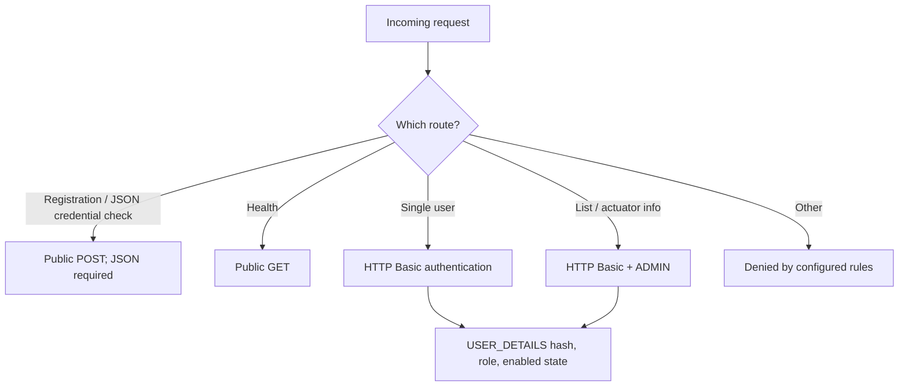

- BCrypt cost is 12; passwords are hashed, not stored as reversible plaintext by this API.
- Spring's `UserDetailsService` adapts a database account into a security user. Database role ADMIN becomes authority ROLE_ADMIN.
- HTTP Basic sends credentials with each protected request; its encoding is not encryption. Use HTTPS for remote deployment.
- The service is stateless; form login, logout and request caching are disabled.
- CSRF is ignored for `/userdetails` and `/authuserdetails`; it is not globally disabled.
- Public registration cannot choose ADMIN through the declared request DTO. Administrative role changes are outside these APIs.
- A disabled account cannot authenticate. The list/profile representation still includes an enabled flag.
- There is no explicit cross-origin browser/CORS configuration. A frontend on another origin may require a separate deployment change; successful curl calls do not prove browser preflight will work.
- A simple GET to `/userInfoServices/` is not a greeting route in this code. No frontend pages or root controller are implemented.

## 11. The db folder and what runs manually

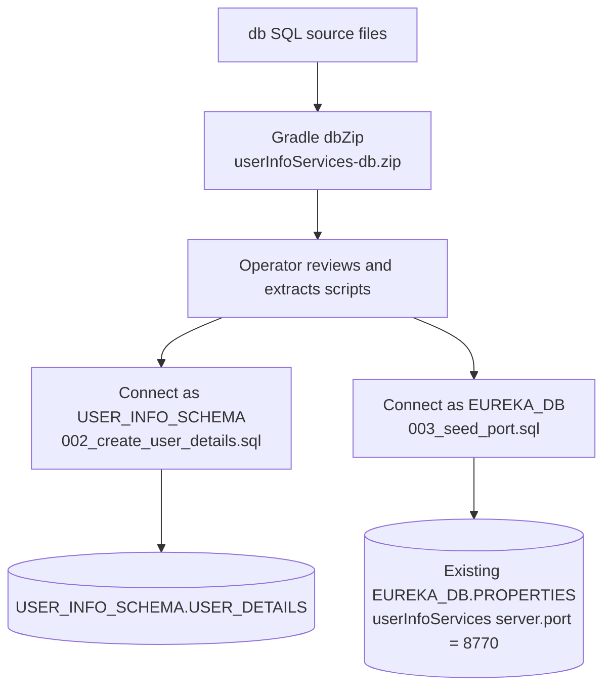

Neither folder names nor ZIP extraction switch the Oracle login. Connect using the appropriate owner before execution. Accounts and credentials are provisioned externally; the ZIP has no CREATE USER or GRANT script.

[002_create_user_details.sql](C:/Users/NagarajanSubramani/Services/userInfoServices/db/USER_INFO_SCHEMA/002_create_user_details.sql) defines:

| Column / rule | Purpose |
| --- | --- |
| ID identity + primary key | Database-generated identifier |
| USERNAME unique, required | Normalized application login name |
| PASSWORD_HASH required | BCrypt result, not plaintext |
| EMAIL unique, required | Contact address |
| PHONE_NUMBER required | Contact number |
| USER_ROLE | USER default; constrained to USER or ADMIN |
| ENABLED | 1 default; constrained to 0 or 1 |
| CREATED_AT, MODIFIED_AT | TIMESTAMP WITH TIME ZONE; both default to SYSTIMESTAMP at insertion |

There is no trigger or update API that automatically advances MODIFIED_AT after insertion. A future update operation must maintain it deliberately. Direct SQL must also preserve username/email normalization; ordinary uniqueness constraints alone do not enforce lowercase values.

[003_seed_port.sql](C:/Users/NagarajanSubramani/Services/userInfoServices/db/EUREKA_DB/003_seed_port.sql) performs MERGE: update the exact matching `userInfoServices/jdbc/jdbc/server.port` row to 8770, otherwise insert it, then COMMIT. It does not alter the Eureka server's port row or create PROPERTIES.

The PROPERTIES table belongs to the existing Eureka setup. This service does not create `USER_INFO_SCHEMA.PROPERTIES`. Any legacy table from an earlier setup is not automatically dropped or migrated.

The SQL scripts retain SQL*Plus error handling but no longer contain the removed session/schema/PDB guard. Oracle DDL commits implicitly; ROLLBACK cannot undo a completed CREATE TABLE. Review before running a creation script against an existing database.

## 12. Gradle and dependencies

[build.gradle](C:/Users/NagarajanSubramani/Services/userInfoServices/build.gradle) specifies Java 25, Spring Boot 4.1.1 and Spring Cloud BOM 2025.1.3. The wrapper selects Gradle 9.3.0. These are the configured versions, not a claim that all are the newest available versions.

| Dependency / plugin | Role |
| --- | --- |
| java + war plugins | Java compilation and WAR packaging tasks |
| Spring Boot Gradle plugin | Executable Boot WAR assembly |
| dependency-management + Cloud BOM | Coordinate dependency versions |
| spring-boot-starter-webmvc | REST/MVC routing and JSON request/response infrastructure |
| spring-boot-starter-validation | Jakarta validation used by DTOs and controller parameters |
| spring-boot-starter-security | HTTP Basic, authentication/authorization and password APIs |
| spring-boot-starter-jdbc | JdbcTemplate and datasource/pool support |
| spring-boot-starter-actuator | Health/info endpoints |
| spring-cloud-starter-netflix-eureka-client | Eureka client registration and registry lookup |
| Oracle ojdbc17 | Oracle JDBC Thin runtime driver; SQL*Plus is not used by Java requests |
| Tomcat runtime provided dependency | Embedded execution with a container-compatible WAR layout |
| starter-test + security-test + JUnit launcher | Test infrastructure and mocks |
| H2 testRuntimeOnly | Disposable test database; not the production Oracle database |

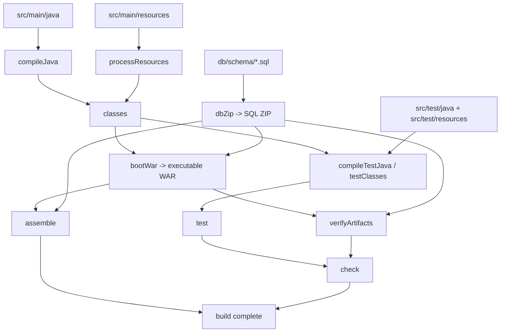

This diagram shows task dependencies, not one mandatory serial execution timeline. `bootWar` depends on `dbZip`, but SQL is still outside the WAR.

- `dbZip` includes only `**/*.sql`, preserving schema folders and excluding empty directories; duplicate ZIP entries fail.
- `verifyArtifacts` checks resources and Tomcat layout, rejects SQL in the WAR and compares ZIP entries against source SQL.
- `jar`, `bootJar` and plain `war` outputs are disabled; `bootWar` is the selected application artifact.
- Archive timestamps/order are normalized for reproducible packaging.
- `gradle.properties` limits the Gradle JVM heap to 512 MB and workers to 2. These are not deployment JVM memory settings.
- `clean` removes generated build output. On Windows it can fail if a running Java process has the WAR open; stop that particular application before cleaning/replacing its WAR.

### application.yml is copied, not regenerated

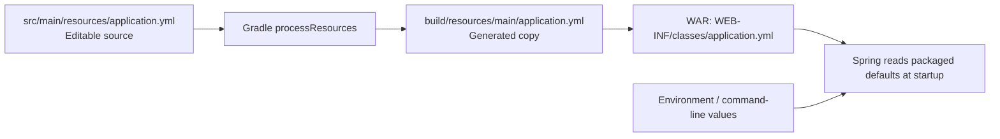

The current build script does not generate the source YAML afresh. Editing source YAML does not retroactively change an already built WAR. Rebuild for source changes, or use the supported external runtime settings.

### What is inside the WAR?

```text
userInfoServices.war
├── META-INF/MANIFEST.MF               Boot launcher and application metadata
├── org/springframework/boot/loader/   Executable archive launcher
└── WEB-INF/
    ├── classes/                       Application bytecode and resources
    ├── lib/                           Runtime application libraries
    └── lib-provided/                  Container-provided/embedded Tomcat libraries
```

Java source is compiled into `.class` bytecode. The SQL ZIP is a separate deployment input, not embedded SQL awaiting automatic execution.

## 13. Test folders and what the passing tests establish

The inspected test reports and validation record show **225 tests, zero failures/errors/skips** across nine classes. This explanation did not rerun them or contact Oracle.

| Suite | Count | What it checks |
| --- | ---: | --- |
| UserApiIntegrationTest | 43 | Real local HTTP, security, validation, safe responses, authorization, pagination and H2 JDBC behavior |
| DatabasePortBootstrapIntegrationTests | 1 | Spring startup hook registration and own-port application |
| DatabasePortEnvironmentPostProcessorTests | 27 | Own-port enablement, priority, credential isolation and failures |
| DatabaseReadinessTests | 11 | Identity/table-column startup checks |
| EurekaBootstrapIntegrationTests | 2 | Endpoint/port settings reaching real Eureka configuration binding |
| EurekaDatabasePortEnvironmentPostProcessorTests | 53 | URL handling, aliases, independent port, skip modes and errors |
| OracleEurekaPortReaderTests | 38 | Query selection, credentials, identity, bounds, cleanup and error redaction |
| OraclePortReaderTests | 40 | Shared table, own application selector and corresponding reader checks |
| PropertiesDatabaseSettingsTests | 10 | Separate settings, no credential fallback and secret-safe failures |

`src/test/resources/test-schema.sql` prepares disposable H2 test data structures. Test SQL is not the production db ZIP. Mocked Oracle readers do not prove real database grants, passwords, tunnels, Oracle DDL execution or live Eureka registration; those need deployment checks.

## 14. Scratchpad: follow one user through the layers

Use this as a whiteboard exercise; values below are invented.

### Input

```json
{
  "username": "Asha.Dev",
  "password": "<a private valid password>",
  "email": "ASHA@example.com",
  "phoneNumber": "+919876543210"
}
```

| Step | Value or responsibility |
| --- | --- |
| HTTP | POST `/userInfoServices/userdetails`, JSON body |
| CreateUserRequest | Carries four submitted fields |
| Validation | Checks name/phone/email structure and password limits |
| UserController | Chooses create operation; delegates |
| UserService | `Asha.Dev` -> `asha.dev`; email -> `asha@example.com`; hashes original password |
| UserRepository | Parameterized INSERT; chooses USER and enabled 1 |
| Oracle | Generates an ID, for example 101, and timestamp defaults |
| Readback | Builds internal UserAccount including stored hash |
| toResponse | Drops the hash from output |
| HTTP | Returns 201 and a Location ending `/userdetails/101` |

Later:

```text
POST /authuserdetails with correct asha.dev credentials
    -> verifies the password -> 200 with authenticated:true
    -> does NOT establish a session

GET /userdetails/101 without Basic credentials
    -> 401

GET /userdetails/101 with asha.dev Basic credentials
    -> 200, if 101 is Asha's record

GET /userdetails/another-id with asha.dev Basic credentials
    -> 404, unless Asha has ADMIN authority

GET /userdetails with ordinary asha.dev credentials
    -> 403: collection is ADMIN-only
```

### Startup scratchpad

```text
USER_INFO_PORT = 8770
USER_INFO_DB_PORT_ENABLED = false
    -> own listener uses normal configured 8770

USER_INFO_DB_PORT_ENABLED = true
EUREKA_DB.PROPERTIES userInfoServices row = 8775
    -> own listener uses 8775, not the YAML default 8770

EUREKA_URL template = http://discovery-host/eureka-server/eureka/
EUREKA_DB.PROPERTIES eureka-server row = 8760
    -> registration endpoint = http://discovery-host:8760/eureka-server/eureka/

USER_INFO_DB_PASSWORD
    -> only user-data connection
EUREKA_DB_PASSWORD
    -> only shared-port lookup connections
```

The 8775/8760 rows above are examples, not a statement about the current live database.

## 15. Quick glossary and reading order

| Term in the code | Plain-language meaning |
| --- | --- |
| DTO / record | A declared shape of input/output data |
| Bean | An object managed by Spring |
| Constructor injection | Spring supplies a class's collaborators when creating it |
| @Bean / @Configuration | Methods/classes that define managed components |
| @RestController | HTTP request handlers returning response bodies |
| @Service | Business-operation component |
| @Repository | SQL/data-access component |
| @RequestBody / @RequestParam / @PathVariable | Read JSON body / query string / URL segment |
| @Valid and constraints | Check input before normal operation |
| @Transactional | Establish a database transaction around an operation |
| JdbcTemplate | Execute SQL and map results without repeating low-level JDBC plumbing |
| Hikari pool | Reuse a bounded set of database connections |
| EnvironmentPostProcessor | Modify startup properties before ordinary application components start |
| BOM | A coordinated set of dependency-version choices |
| WAR | Deployable archive for servlet applications, executable here through Boot |

Recommended reading order:

1. `application.yml` — names, URLs and flags.
2. `UserController` — visible operations.
3. Request/response records and `ValidPassword` — the API contract.
4. `UserService` — business rules.
5. `UserRepository` and `UserAccount` — database mapping.
6. `SecurityConfiguration` and `ApiExceptionHandler` — access and failures.
7. Startup processors/readers — why the correct ports and schema credentials matter.
8. SQL scripts, build.gradle and tests — setup, packaging and verification.

## 16. What is not implemented yet

There is no frontend UI, update/delete user endpoint, password reset, email/phone verification, public role-management endpoint, JWT/session login, automatic schema migration, automatic SSH tunnel creation or live port reload. Adding one requires a deliberate change; do not infer it from a similarly named class or database column.

The short mental model is:

**config prepares -> security checks -> api accepts -> service decides -> repository queries -> domain maps -> api responds.**
